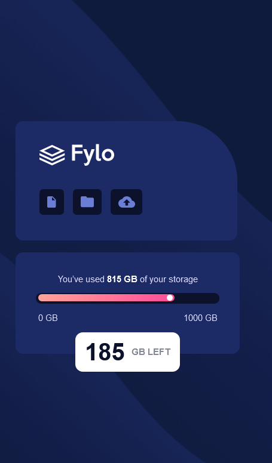

# Frontend Mentor - Fylo data storage component solution

This is a solution to the [Fylo data storage component challenge on Frontend Mentor](https://www.frontendmentor.io/challenges/fylo-data-storage-component-1dZPRbV5n). Frontend Mentor challenges help you improve your coding skills by building realistic projects. 

## Table of contents

- [Overview](#overview)
  - [The challenge](#the-challenge)
  - [Screenshot](#screenshot)
  - [Links](#links)
- [My process](#my-process)
  - [Built with](#built-with)
  - [What I learned](#what-i-learned)
- [Author](#author)


## Overview


### The challenge

Users should be able to:

- View the optimal layout for the site depending on their device's screen size

### Screenshot

- Mobile view for 375px:



-Laptop view for 1440px:


### Links

- Solution URL: [Frontend Mentor](https://www.frontendmentor.io/solutions/fylo-data-storage-component-with-flex-grid-and-animations-3adNVhGkY-)
- Live Site URL: [Github Pages](https://amrmabdelazeem.github.io/fylo-data-storage-component/)

## My process
- Understand the requirments.
- Set up project with a basic file structure, including HTML and CSS.
- Create the HTML structure based on the design provided in the challenge.
- Build mobile first workflow.
- Style the HTML elements according to the design.
- Build layout for the desktop responsively.
- Animate the progress bar with CSS.
- Test the result.
- Deploy to github.


### Built with

- Semantic HTML5 markup
- CSS custom properties
- Flexbox
- CSS Grid
- Mobile-first workflow
- Responsive design
- CSS Animations

### What I learned

How to create a triangle with only CSS borders.

```css
.proud-of-this-css {
  border-right: 0px solid transparent;
        border-left: 30px solid transparent;
        border-top: 30px solid #fff;
        width: 0;
        height: 0;;
}
```

## Author

- Website - [Github](https://github.com/amrmabdelazeem)
- Frontend Mentor - [@amrmabdelazeem](https://www.frontendmentor.io/profile/amrmabdelazeem)